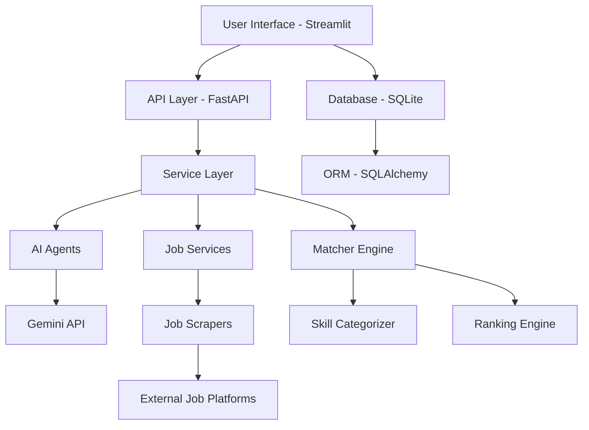

<div align="center">

# 🚀 HireFlow AI

[](https://www.python.org/downloads/release/python-3120/)
[](https://streamlit.io/)
[](LICENSE)
[](https://github.com/Jayesh01323/HireFlow)
[](https://github.com/Jayesh01323/HireFlow)

**AI-Powered Career Intelligence Platform for Freshers & Entry-Level Engineers**

[Features](#-key-features) • [Architecture](#-system-architecture) • [Installation](#-installation) • [Demo](#-screenshots) • [Documentation](#-documentation)

</div>

---

## 📋 Project Overview

**HireFlow AI** is an intelligent career platform that leverages artificial intelligence to help freshers and entry-level software engineers navigate their job search journey. The platform provides comprehensive tools for resume analysis, job matching, skill gap identification, career coaching, and interview preparation.

### 🎯 Problem Statement

Fresh graduates and entry-level developers face significant challenges:
- **Resume Optimization**: Difficulty tailoring resumes to specific job requirements
- **Skill Gap Analysis**: Uncertainty about which skills to prioritize for target roles
- **Job Discovery**: Overwhelming number of job platforms with inconsistent information
- **Career Guidance**: Lack of personalized career advice and interview preparation
- **Application Tracking**: Difficulty managing multiple job applications efficiently

### 💡 Solution

HireFlow AI addresses these challenges through:
- **AI-Powered Resume Parsing**: Extract and analyze resume data using Google Gemini API
- **Intelligent Job Matching**: Match resumes against job descriptions with weighted scoring
- **Skill Gap Analysis**: Identify missing skills with learning recommendations
- **Career Coaching**: AI-driven personalized career guidance
- **Job Aggregation**: Scrape jobs from multiple platforms (LinkedIn, Internshala, Naukri, etc.)
- **Application Tracking**: Manage job applications with status tracking

---

## ✨ Key Features

### 📄 Resume Intelligence
- **Smart Parsing**: Extract structured data from PDF resumes using AI
- **ATS Optimization**: Improve resume compatibility with applicant tracking systems
- **Skill Extraction**: Automatically identify and categorize technical and soft skills
- **Resume Scoring**: Get actionable feedback on resume quality

### 🎯 Job Matching Engine
- **Intelligent Matching**: Compare resume skills against job requirements
- **Weighted Scoring**: Priority-based skill matching (High/Medium/Low)
- **Category Analysis**: Break down matches by skill categories (Frontend, Backend, DevOps, etc.)
- **Gap Analysis**: Identify missing skills with learning recommendations

### 📊 Job Discovery
- **Multi-Platform Aggregation**: Scrape jobs from LinkedIn, Internshala, Naukri, Glassdoor, Wellfound
- **Smart Filtering**: Filter by location, salary, experience, work mode
- **Deduplication**: Remove duplicate job postings automatically
- **Real-time Updates**: Fresh job data with regular scraping

### 🧠 Career Coaching
- **AI Career Assistant**: Get personalized career advice and guidance
- **Interactive Chat**: AI-powered career Q&A interface
- **Career Fit Analysis**: Match profile against various career paths
- **Interview Preparation**: Generate role-specific interview questions

### 📈 Analytics Dashboard
- **Application Tracking**: Monitor job application status and progress
- **Skill Analytics**: Visualize skill distribution and growth
- **Learning Roadmaps**: Personalized learning plans with milestones
- **Performance Metrics**: Track career readiness scores

### 🔧 Additional Features
- **Application Workflow**: End-to-end application management
- **Alert System**: Notifications for new jobs and application updates
- **Export Functionality**: Generate reports and summaries
- **Responsive Design**: Clean, intuitive user interface

---

## 🏗️ System Architecture



### Component Overview

| Component | Technology | Purpose |
|-----------|-----------|---------|
| **Frontend** | Streamlit | Interactive web interface |
| **Backend API** | FastAPI | RESTful API endpoints |
| **Database** | SQLite + SQLAlchemy | Data persistence and ORM |
| **AI Engine** | Google Gemini API | Resume parsing and career coaching |
| **Job Scraping** | Selenium + BeautifulSoup | Multi-platform job aggregation |
| **Matching Engine** | Custom Algorithm | Weighted skill matching |
| **Visualization** | Plotly | Interactive charts and graphs |

---

## 🛠️ Technology Stack

### Core Technologies
- **Python 3.12**: Modern Python with type hints and async support
- **Streamlit 1.32+**: Rapid web application development
- **FastAPI**: High-performance API framework
- **SQLAlchemy 2.0**: Modern Python SQL toolkit and ORM

### AI & Machine Learning
- **Google Gemini API**: Advanced AI for resume parsing and coaching
- **FuzzyWuzzy/RapidFuzz**: String matching and similarity scoring
- **Custom Matching Algorithm**: Weighted skill matching with priority levels

### Data Processing
- **Pandas**: Data manipulation and analysis
- **PyMuPDF**: PDF parsing for resume extraction
- **Pydantic**: Data validation and settings management

### Web Scraping
- **Selenium**: Browser automation for dynamic content
- **BeautifulSoup4**: HTML parsing and data extraction
- **Requests**: HTTP library for web scraping

### Visualization
- **Plotly**: Interactive charts and graphs
- **Streamlit Components**: Custom UI components

### Development Tools
- **python-dotenv**: Environment variable management
- **Logging**: Comprehensive logging system
- **Type Hints**: Full type annotation coverage

---

## 📦 Installation

### Prerequisites
- Python 3.12 or higher
- pip (Python package manager)
- Google Gemini API Key

### Step 1: Clone the Repository
```bash
git clone https://github.com/Jayesh01323/HireFlow.git
cd HireFlow
```

### Step 2: Create Virtual Environment
```bash
python -m venv venv
source venv/bin/activate  # On Windows: venv\Scripts\activate
```

### Step 3: Install Dependencies
```bash
pip install -r requirements.txt
```

### Step 4: Configure Environment Variables
```bash
cp .env.example .env
```

Edit `.env` and add your API key:
```env
GEMINI_API_KEY=your_gemini_api_key_here
DATABASE_URL=sqlite:///data/hireflow.db
```

### Step 5: Initialize Database
```bash
python -c "from src.database import init_db; init_db()"
```

### Step 6: Run the Application
```bash
streamlit run app.py
```

The application will be available at `http://localhost:8501`

---

## 🚀 Usage Guide

### 1. Upload and Parse Resume
- Navigate to **Resume Parser** page
- Upload your PDF resume
- AI will extract and structure your data
- Review parsed information and skills

### 2. Discover Jobs
- Go to **Job Discovery** page
- Search for jobs by title, location, or skills
- Apply filters (remote, salary, experience)
- Save interesting jobs to your list

### 3. Match Your Resume to Jobs
- Visit **Job Matcher** page
- Select your parsed resume
- Paste job description
- Get detailed match analysis with skill gaps

### 4. Get Career Guidance
- Use **Career Assistant** for personalized advice
- Try interactive AI chat for career Q&A
- Check **Career Fit** for role compatibility

### 5. Track Applications
- Use **Application Tracker** to manage applications
- Update status (Saved, Applied, Interview, Offer, Rejected)
- Add notes and follow-up reminders

### 6. View Analytics
- Check **Analytics Dashboard** for insights
- Monitor skill distribution and growth
- Track application success rates

---

## 📸 Screenshots

### Main Dashboard

*Central hub for navigating all features*

### Resume Parser

*AI-powered resume extraction and analysis*

### Job Matcher

*Intelligent skill matching with gap analysis*

### Analytics Dashboard

*Comprehensive career analytics and insights*

> 📸 **Note**: Screenshots will be added in Phase 6. For now, placeholders are shown.

---

## 📁 Project Structure

```
hireflow-ai/
├── app.py                          # Main Streamlit entry point
├── requirements.txt                # Python dependencies
├── .env.example                    # Environment variable template
├── .gitignore                      # Git ignore rules
├── LICENSE                         # MIT License
├── README.md                       # This file
├── Dockerfile                      # Container build
├── docker-compose.yml              # Container orchestration
│
├── data/                           # Database and uploads
│   └── .gitkeep                    # Ensure directory exists
│
├── docs/                           # Documentation
│   ├── architecture.md             # System architecture
│   ├── installation.md             # Installation guide
│   ├── api-reference.md            # API documentation
│   ├── user-guide.md               # User guide
│   ├── developer-guide.md          # Developer guide
│   ├── roadmap.md                  # Project roadmap
│   ├── deployment/                 # Deployment guides
│   │   ├── railway.md
│   │   ├── render.md
│   │   └── streamlit.md
│   ├── audits/                     # Audit reports
│   │   ├── AUDIT_REPORT.md
│   │   └── PRODUCT_AUDIT_REPORT.md
│   ├── project/                    # Project management docs
│   │   ├── CHANGELOG.md
│   │   ├── VERSIONING.md
│   │   ├── RELEASE_NOTES.md
│   │   ├── elevator-pitch.md
│   │   ├── linkedin-content.md
│   │   └── resume-projects.md
│   ├── security/                   # Security documentation
│   │   └── SECURITY.md
│   └── contributing/               # Community guidelines
│       ├── CONTRIBUTING.md
│       └── CODE_OF_CONDUCT.md
│
├── pages/                         # Streamlit multi-page modules
│   ├── Resume_Parser.py
│   ├── Job_Matcher.py
│   ├── Job_Discovery.py
│   ├── Skill_Gap.py
│   ├── Career_Assistant.py
│   ├── Application_Tracker.py
│   ├── Analytics_Dashboard.py
│   └── Learning_Dashboard.py
│
├── src/                           # Core application logic
│   ├── agents/                    # AI agents
│   ├── ai/                        # AI integration
│   ├── api/                       # API endpoints
│   ├── database/                  # Database layer
│   ├── jobs/                      # Job processing
│   ├── services/                  # Business logic
│   ├── utils/                     # Utilities
│   ├── database.py
│   ├── matcher.py
│   ├── parser.py
│   ├── gemini.py
│   └── utils.py
│
├── tests/                         # Test suite
│   ├── test_job_connectors.py
│   ├── test_phase4_services.py
│   ├── test_job_discovery_engine.py
│   ├── debug_job_discovery.py
│   └── validation_test_matcher.py
│
├── reports/                       # Generated reports
│   └── validation_report.json
│
└── resume-analyzer/               # Frontend app (Next.js)
    ├── .gitignore
    ├── package.json
    ├── next.config.js
    └── src/
```

---

## 🔌 API Overview

### REST API Endpoints

#### Jobs API
- `GET /api/jobs` - List all jobs with filters
- `GET /api/jobs/{id}` - Get job details
- `POST /api/jobs/search` - Search jobs
- `GET /api/jobs/sources` - List job sources

#### Resume API
- `POST /api/resume/upload` - Upload resume
- `GET /api/resume/{id}` - Get resume details
- `POST /api/resume/parse` - Parse resume text

#### Alerts API
- `GET /api/alerts` - Get user alerts
- `POST /api/alerts` - Create alert
- `PUT /api/alerts/{id}/read` - Mark as read

#### Tracker API
- `GET /api/applications` - List applications
- `POST /api/applications` - Create application
- `PUT /api/applications/{id}` - Update application status

### API Documentation
Detailed API documentation is available in [docs/api-reference.md](docs/api-reference.md)

---

## 🗺️ Future Roadmap

### Version 1.1 (Q3 2026)
- [ ] User authentication and authorization
- [ ] Email notifications for job alerts
- [ ] Export to PDF/Excel functionality
- [ ] Mobile-responsive design improvements
- [ ] Advanced filtering options

### Version 1.2 (Q4 2026)
- [ ] Real-time job updates with WebSocket
- [ ] Integration with LinkedIn API
- [ ] Collaborative features for teams
- [ ] Advanced analytics with ML insights
- [ ] Performance optimization and caching

### Version 2.0 (Q1 2027)
- [ ] Mobile app (React Native)
- [ ] Premium subscription tier
- [ ] Company profiles and reviews
- [ ] Salary estimation tool
- [ ] Video interview preparation

### Version 2.1 (Q2 2027)
- [ ] AI-powered cover letter generation
- [ ] Resume templates and builder
- [ ] Community features and forums
- [ ] Integration with ATS systems
- [ ] White-label solution for companies

---

## 🤝 Contributing

We welcome contributions from the community! Please read our [CONTRIBUTING.md](docs/contributing/CONTRIBUTING.md) for details on our code of conduct and the process for submitting pull requests.

### How to Contribute
1. Fork the repository
2. Create a feature branch (`git checkout -b feature/amazing-feature`)
3. Commit your changes (`git commit -m 'Add amazing feature'`)
4. Push to the branch (`git push origin feature/amazing-feature`)
5. Open a Pull Request

### Development Guidelines
- Follow PEP 8 style guidelines
- Add type hints to all functions
- Write tests for new features
- Update documentation as needed
- Keep commits focused and atomic

---

## 📄 License

This project is licensed under the MIT License - see the [LICENSE](LICENSE) file for details.

### MIT License Summary
- ✅ Free to use for personal and commercial projects
- ✅ Free to modify and distribute
- ✅ No warranty or liability
- ✅ Must include license and copyright notice

---

## 👨‍💻 Author

**Jayesh**
- GitHub: [@Jayesh01323](https://github.com/Jayesh01323)
- LinkedIn: [Jayesh](https://linkedin.com/in/jayesh)
- Email: jayesh@example.com

### Acknowledgments
- Google Gemini API for AI capabilities
- Streamlit team for the amazing framework
- Open source community for various libraries

---

## 📊 Project Stats

- **Total Files**: 70+ Python files
- **Lines of Code**: 15,000+
- **Test Coverage**: Expanding
- **API Endpoints**: 15+
- **Job Sources**: 6 platforms
- **Skill Categories**: 12 categories
- **Supported Formats**: PDF, JSON

---

## 🙏 Support

If you find this project helpful, please consider:
- ⭐ Starring the repository on GitHub
- 🐛 Reporting bugs via [Issues](https://github.com/Jayesh01323/HireFlow/issues)
- 💡 Suggesting features via [Discussions](https://github.com/Jayesh01323/HireFlow/discussions)
- 📢 Sharing with your network

---

## 📞 Contact

For questions, support, or collaboration:
- Open an [Issue](https://github.com/Jayesh01323/HireFlow/issues)
- Email: jayesh@example.com
- LinkedIn: [Jayesh](https://linkedin.com/in/jayesh)

---

<div align="center">

**Built with ❤️ for the developer community**

[⬆ Back to Top](#-hireflow-ai)

</div>
