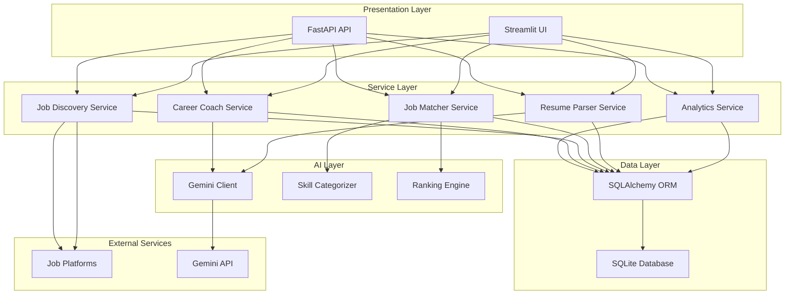
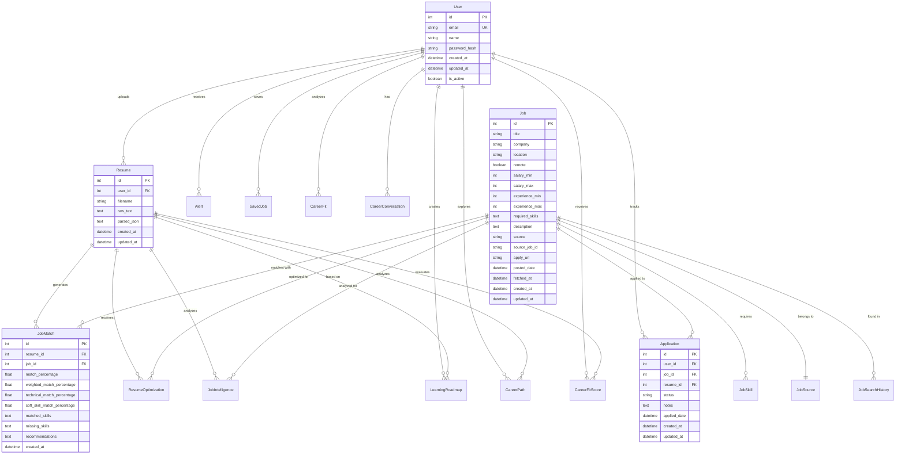
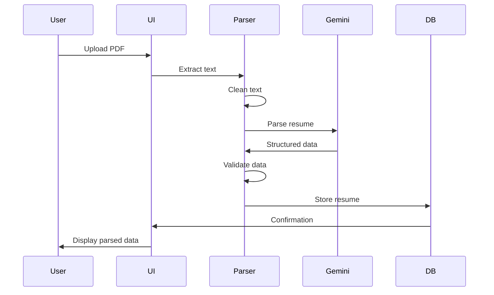
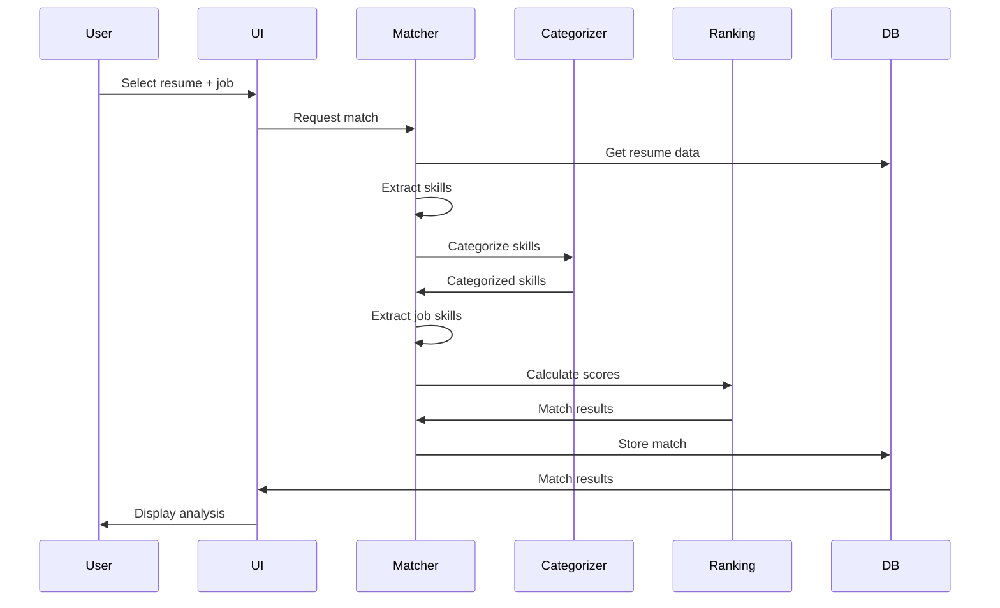
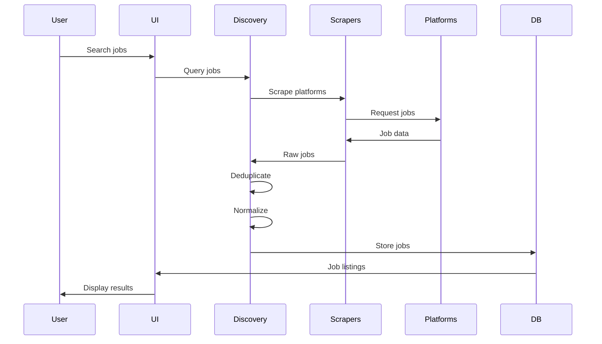

# HireFlow AI - Architecture Documentation

## Table of Contents

- [System Overview](#system-overview)
- [Architecture Diagram](#architecture-diagram)
- [Component Architecture](#component-architecture)
- [Database Schema](#database-schema)
- [Data Flow](#data-flow)
- [Technology Stack](#technology-stack)
- [Design Patterns](#design-patterns)
- [Security Architecture](#security-architecture)
- [Scalability Considerations](#scalability-considerations)

---

## System Overview

HireFlow AI is a multi-tier application with the following layers:

1. **Presentation Layer**: Streamlit-based web interface
2. **API Layer**: FastAPI REST endpoints
3. **Service Layer**: Business logic and processing
4. **Data Access Layer**: SQLAlchemy ORM
5. **External Services**: Gemini AI, Job Platforms

### Architecture Principles

- **Separation of Concerns**: Clear separation between UI, business logic, and data access
- **Modularity**: Independent, reusable components
- **Scalability**: Designed for horizontal scaling
- **Maintainability**: Clean code with proper documentation
- **Security**: Environment-based configuration and input validation

---

## Architecture Diagram

---

## Component Architecture

### Presentation Layer

#### Streamlit UI
- **Purpose**: User interface for all features
- **Components**: 12 multi-page modules
- **State Management**: Streamlit session state
- **Routing**: Built-in Streamlit navigation

#### FastAPI API
- **Purpose**: RESTful API for external integrations
- **Endpoints**: Jobs, Resume, Alerts, Tracker
- **Authentication**: Planned (OAuth2)
- **Documentation**: Auto-generated with Swagger

### Service Layer

#### Resume Parser Service
- **Input**: PDF resume files
- **Processing**: Text extraction → AI parsing → Structuring
- **Output**: JSON with skills, experience, education
- **AI Integration**: Gemini API for intelligent parsing

#### Job Matcher Service
- **Input**: Resume data + Job description
- **Processing**: Skill extraction → Categorization → Weighted matching
- **Output**: Match score, skill gaps, recommendations
- **Algorithm**: Custom weighted scoring with priority levels

#### Job Discovery Service
- **Input**: Search queries, filters
- **Processing**: Multi-platform scraping → Deduplication → Normalization
- **Output**: Unified job listings
- **Sources**: LinkedIn, Internshala, Naukri, Glassdoor, Wellfound

#### Career Coach Service
- **Input**: User profile, career questions
- **Processing**: Context analysis → AI generation
- **Output**: Personalized career advice
- **AI Integration**: Gemini API for coaching

#### Analytics Service
- **Input**: Application data, skill data
- **Processing**: Aggregation → Visualization
- **Output**: Charts, metrics, insights
- **Visualization**: Plotly interactive charts

### AI Layer

#### Gemini Client
- **Purpose**: Unified interface to Google Gemini API
- **Features**: Resume parsing, career coaching, interview questions
- **Rate Limiting**: Built-in retry logic
- **Error Handling**: Graceful degradation

#### Skill Categorizer
- **Purpose**: Classify skills into categories
- **Categories**: 12 categories (Frontend, Backend, DevOps, etc.)
- **Algorithm**: Rule-based + ML hybrid
- **Updates**: Regular skill database updates

#### Ranking Engine
- **Purpose**: Rank jobs by relevance
- **Factors**: Skill match, location, salary, experience
- **Algorithm**: Multi-factor scoring
- **Personalization**: User preference learning

### Data Access Layer

#### SQLAlchemy ORM
- **Purpose**: Database abstraction and ORM
- **Models**: 15+ database models
- **Relationships**: Proper foreign key relationships
- **Migrations**: Version-controlled schema changes

#### Database Models
- **User**: User accounts and preferences
- **Resume**: Parsed resume data
- **Job**: Job listings from various sources
- **JobMatch**: Resume-job matching results
- **Application**: Application tracking
- **Alert**: User notifications
- **CareerFit**: Career path analysis
- **LearningRoadmap**: Personalized learning plans

---

## Database Schema

### Entity Relationship Diagram

### Database Design Principles

1. **Normalization**: Third normal form (3NF)
2. **Indexing**: Strategic indexes on frequently queried columns
3. **Relationships**: Proper foreign key constraints
4. **Data Types**: Appropriate data types for each field
5. **Timestamps**: Created/updated timestamps on all tables

---

## Data Flow

### Resume Parsing Flow

### Job Matching Flow

### Job Discovery Flow

---

## Technology Stack

### Frontend
- **Streamlit 1.32+**: Web framework
- **Plotly 5.19+**: Data visualization
- **HTML/CSS**: Custom styling

### Backend
- **Python 3.12**: Programming language
- **FastAPI 0.100+**: API framework
- **Uvicorn 0.23+**: ASGI server

### Database
- **SQLite 3**: Development database
- **SQLAlchemy 2.0+**: ORM
- **Alembic**: Database migrations

### AI/ML
- **Google Gemini API**: AI services
- **FuzzyWuzzy**: String matching
- **RapidFuzz**: Fast string matching

### Web Scraping
- **Selenium 4.18+**: Browser automation
- **BeautifulSoup4 4.12+**: HTML parsing
- **Requests 2.31+**: HTTP client

### Data Processing
- **Pandas 2.2+**: Data manipulation
- **PyMuPDF 1.24+**: PDF parsing
- **Pydantic 2.6+**: Data validation

---

## Design Patterns

### 1. Repository Pattern
Data access abstracted through repository classes for clean separation.

### 2. Service Layer Pattern
Business logic encapsulated in service classes.

### 3. Factory Pattern
AI agents created using factory pattern for extensibility.

### 4. Strategy Pattern
Different matching algorithms can be swapped easily.

### 5. Observer Pattern
Alert system uses observer pattern for notifications.

### 6. Singleton Pattern
Database connection uses singleton pattern.

---

## Security Architecture

### Authentication & Authorization
- **Current**: Basic user model (no auth implemented)
- **Planned**: OAuth2 with JWT tokens
- **Role-Based Access**: Admin, User, Guest roles

### Data Protection
- **API Keys**: Environment variables only
- **Passwords**: Planned bcrypt hashing
- **PII**: Encrypted at rest (planned)
- **HTTPS**: Required in production

### Input Validation
- **File Uploads**: Type and size validation
- **User Input**: Sanitization and validation
- **SQL Injection**: Prevented by ORM
- **XSS**: HTML escaping in UI

### Audit Logging
- **User Actions**: Logged with timestamps
- **API Calls**: Request/response logging
- **Errors**: Comprehensive error logging

---

## Scalability Considerations

### Current Limitations
- **Database**: SQLite (single-user)
- **Web Server**: Single instance
- **Job Scraping**: Sequential processing
- **AI API**: Rate-limited

### Scaling Strategy

#### Database Scaling
- **Short-term**: PostgreSQL with connection pooling
- **Long-term**: Read replicas + sharding

#### Application Scaling
- **Horizontal**: Multiple Streamlit instances
- **Load Balancing**: Nginx or cloud load balancer
- **Caching**: Redis for session and data caching

#### Job Scraping Scaling
- **Parallel**: Async scraping with asyncio
- **Distributed**: Celery task queue
- **Rate Limiting**: Respect platform limits

#### AI API Scaling
- **Caching**: Cache AI responses
- **Queue**: Request queue for rate limiting
- **Fallback**: Multiple AI providers

---

## Performance Optimization

### Database Optimization
- **Indexing**: Strategic indexes on query columns
- **Query Optimization**: N+1 query prevention
- **Connection Pooling**: Reuse database connections
- **Caching**: Query result caching

### Application Optimization
- **Lazy Loading**: Load data on demand
- **Pagination**: Large dataset pagination
- **Async Operations**: Non-blocking I/O
- **Memoization**: Cache expensive computations

### Frontend Optimization
- **Component Caching**: Streamlit caching
- **Data Streaming**: Stream large datasets
- **Lazy Rendering**: Render on scroll
- **Image Optimization**: Compress images

---

## Monitoring & Logging

### Application Monitoring
- **Health Checks**: Endpoint health monitoring
- **Performance Metrics**: Response times, throughput
- **Error Tracking**: Sentry integration (planned)
- **User Analytics**: Usage patterns (planned)

### Logging Strategy
- **Levels**: DEBUG, INFO, WARNING, ERROR, CRITICAL
- **Format**: Structured JSON logging
- **Rotation**: Daily log rotation
- **Storage**: Centralized log storage (planned)

---

## Deployment Architecture

### Development
- **Local**: Streamlit development server
- **Database**: SQLite local file
- **Environment**: .env file

### Production
- **Platform**: Streamlit Cloud / Render / Railway
- **Database**: PostgreSQL (recommended)
- **CDN**: Static asset delivery
- **Monitoring**: Application performance monitoring

---

## Future Architecture Improvements

### Planned Enhancements
1. **Microservices**: Split into independent services
2. **Event-Driven**: Message queue for async processing
3. **GraphQL**: Alternative to REST API
4. **Real-time**: WebSocket for live updates
5. **Mobile**: React Native mobile app

### Technology Upgrades
1. **Database**: Migration to PostgreSQL
2. **Caching**: Redis implementation
3. **Search**: Elasticsearch for job search
4. **Queue**: Celery for background tasks
5. **Monitoring**: Prometheus + Grafana

---

## Documentation References

- [API Reference](./api-reference.md)
- [Installation Guide](./installation.md)
- [Deployment Guide](./deployment.md)
- [Developer Guide](./developer-guide.md)
- [User Guide](./user-guide.md)

---

**Last Updated**: June 20, 2026  
**Maintained By**: Jayesh  
**Version**: 1.0.0
