# HireFlow AI - Architecture Diagrams

This document contains comprehensive Mermaid diagrams for HireFlow AI's system architecture, workflows, and database design.

---

## 1. System Architecture

### High-Level Architecture

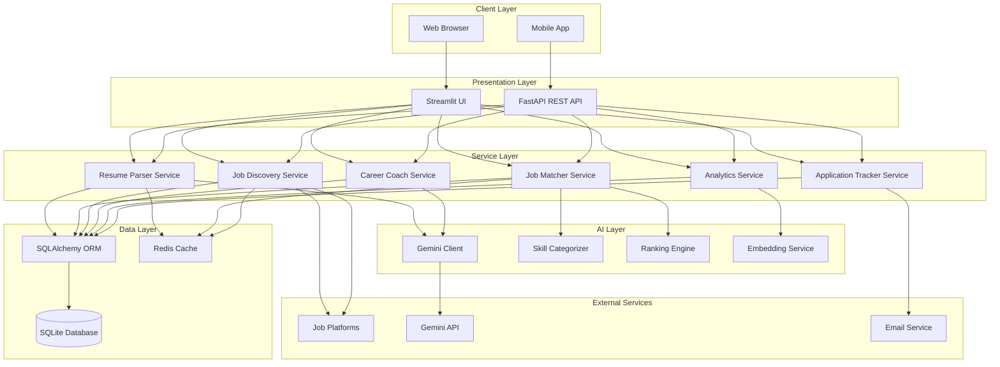

### Component Architecture

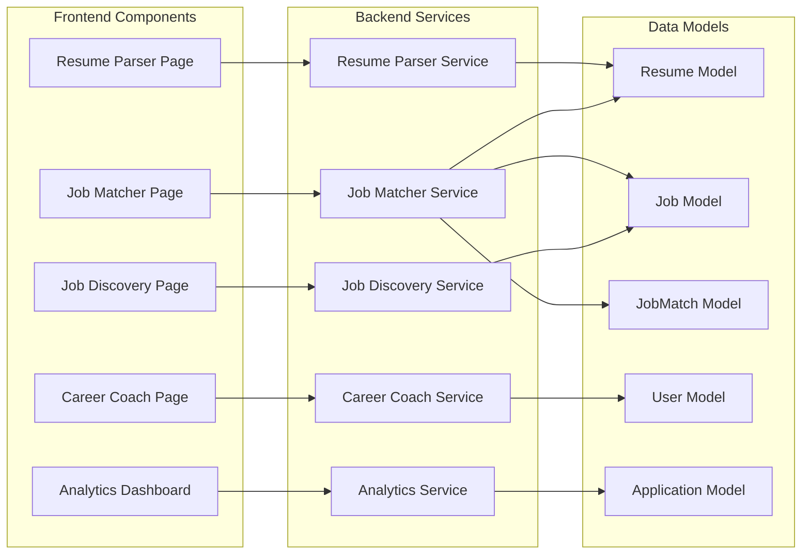

---

## 2. User Flow

### Complete User Journey

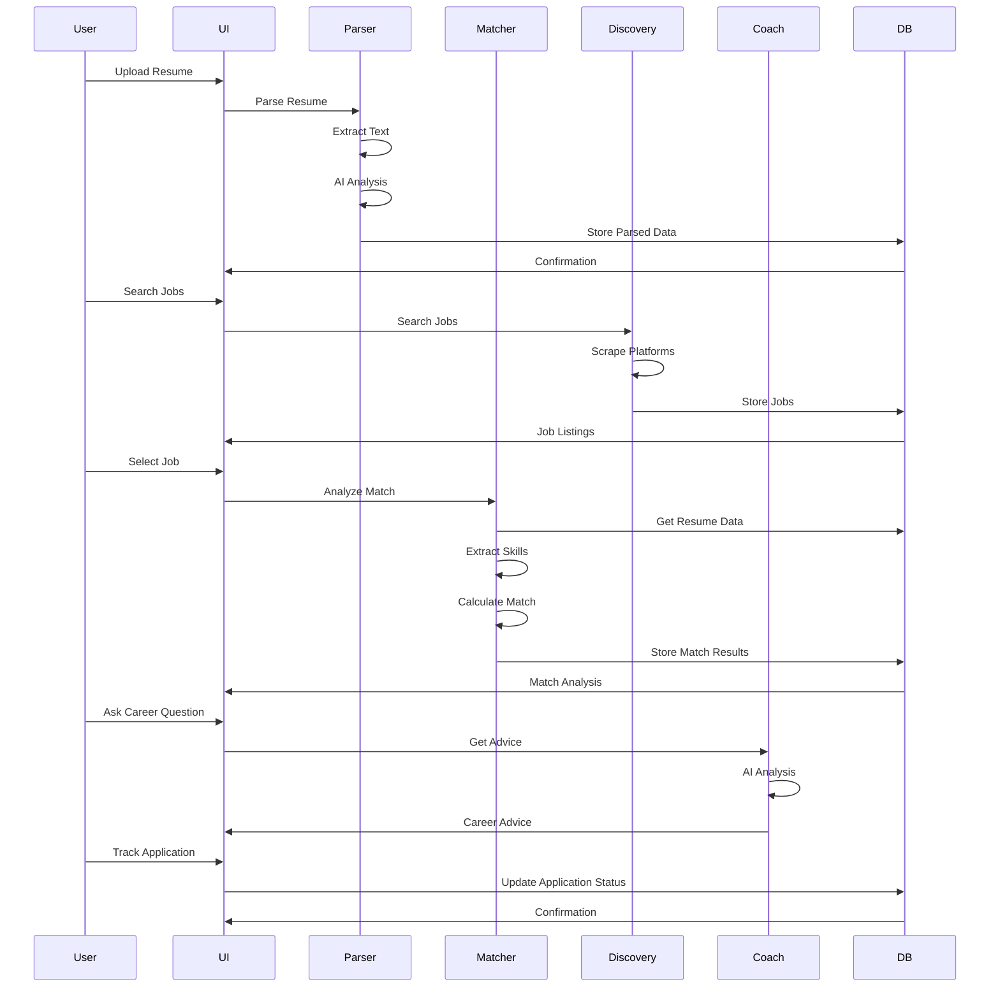

### Resume Upload Flow

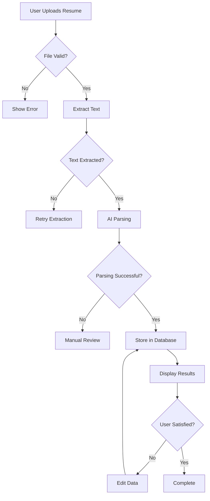

---

## 3. Resume Analysis Workflow

### Resume Processing Pipeline

```mermaid
flowchart LR
    A[PDF Resume] --> B[Text Extraction]
    B --> C[Text Cleaning]
    C --> D[Skill Extraction]
    D --> E[Skill Categorization]
    E --> F[Experience Parsing]
    F --> G[Education Parsing]
    G --> H[Project Extraction]
    H --> I[AI Enhancement]
    I --> J[Data Validation]
    J --> K[Structured JSON]
    K --> L[Database Storage]
```

### Skill Extraction Process

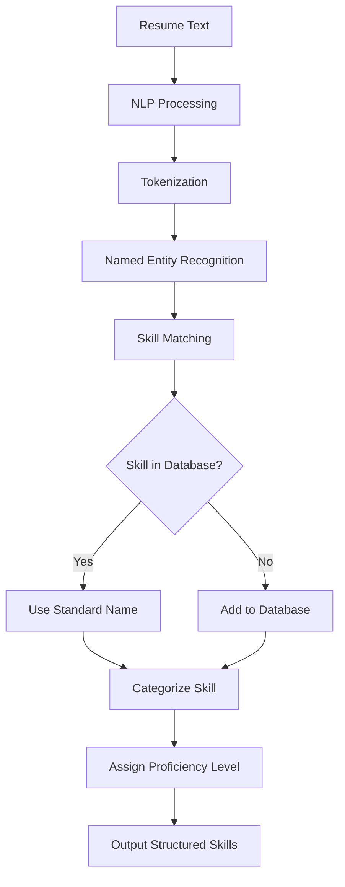

---

## 4. Job Matching Workflow

### Matching Algorithm Flow

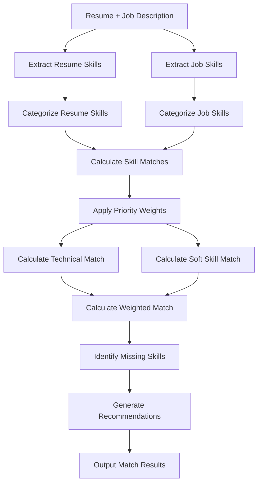

### Priority-Based Scoring

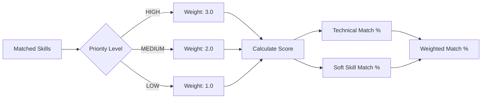

---

## 5. Database ER Diagram

### Complete Entity Relationship Diagram

```mermaid
erDiagram
    User ||--o{ Resume : "uploads"
    User ||--o{ Application : "tracks"
    User ||--o{ Alert : "receives"
    User ||--o{ SavedJob : "saves"
    User ||--o{ CareerFit : "analyzes"
    User ||--o{ CareerConversation : "has"
    User ||--o{ LearningRoadmap : "creates"
    User ||--o{ CareerPath : "explores"
    User ||--o{ CareerFitScore : "receives"
    
    Resume ||--o{ JobMatch : "generates"
    Resume ||--o{ ResumeOptimization : "receives"
    Resume ||--o{ JobIntelligence : "analyzes"
    Resume ||--o{ LearningRoadmap : "based on"
    Resume ||--o{ CareerPath : "analyzes"
    Resume ||--o{ CareerFitScore : "evaluates"
    
    Job ||--o{ JobMatch : "matches with"
    Job ||--o{ Application : "applied to"
    Job ||--o{ JobSkill : "requires"
    Job ||--o{ JobIntelligence : "analyzed for"
    Job ||--o{ ResumeOptimization : "optimized for"
    
    Job ||--|| JobSource : "belongs to"
    Job ||--o{ JobSearchHistory : "found in"
    
    User {
        int id PK
        string email UK
        string name
        string password_hash
        datetime created_at
        datetime updated_at
        boolean is_active
    }
    
    Resume {
        int id PK
        int user_id FK
        string filename
        text raw_text
        text parsed_json
        datetime created_at
        datetime updated_at
    }
    
    Job {
        int id PK
        string title
        string company
        string location
        boolean remote
        int salary_min
        int salary_max
        int experience_min
        int experience_max
        text required_skills
        text description
        string source
        string source_job_id
        string apply_url
        datetime posted_date
        datetime fetched_at
        datetime created_at
        datetime updated_at
    }
    
    JobMatch {
        int id PK
        int resume_id FK
        int job_id FK
        float match_percentage
        float weighted_match_percentage
        float technical_match_percentage
        float soft_skill_match_percentage
        text matched_skills
        text missing_skills
        text recommendations
        datetime created_at
    }
    
    Application {
        int id PK
        int user_id FK
        int job_id FK
        int resume_id FK
        string status
        text notes
        datetime applied_date
        datetime created_at
        datetime updated_at
    }
    
    Alert {
        int id PK
        int user_id FK
        string alert_type
        string title
        text message
        text metadata
        boolean is_read
        datetime created_at
    }
    
    SavedJob {
        int id PK
        int user_id FK
        string job_id
        string job_title
        string company
        string location
        string salary
        string work_mode
        string source
        string source_url
        datetime saved_at
    }
    
    CareerFit {
        int id PK
        int user_id FK
        string career_name
        float score
        text skills_match
        text projects_match
        text experience_match
        text recommendations
        datetime created_at
    }
    
    CareerConversation {
        int id PK
        int user_id FK
        text question
        text answer
        text context
        string conversation_type
        datetime created_at
    }
    
    LearningRoadmap {
        int id PK
        int user_id FK
        int resume_id FK
        string target_role
        string timeline
        text roadmap_data
        text missing_skills
        datetime start_date
        datetime end_date
        float progress_percentage
        datetime created_at
        datetime updated_at
    }
    
    CareerPath {
        int id PK
        int user_id FK
        int resume_id FK
        string top_career_path
        text alternative_paths
        text growth_opportunities
        text recommended_next_steps
        text career_trajectory
        datetime created_at
    }
    
    CareerFitScore {
        int id PK
        int user_id FK
        int resume_id FK
        float overall_score
        float skills_score
        float projects_score
        float experience_score
        float education_score
        string readiness_level
        text breakdown
        text recommendations
        datetime created_at
    }
    
    JobSkill {
        int id PK
        int job_id FK
        string skill
        datetime created_at
    }
    
    JobSource {
        int id PK
        string source_name
        int jobs_fetched
        int jobs_stored
        datetime last_sync
        boolean is_active
        string api_endpoint
        int rate_limit
        datetime created_at
        datetime updated_at
    }
    
    JobSearchHistory {
        int id PK
        int user_id FK
        string query
        string location
        int total_results
        text filters
        datetime created_at
    }
```

---

## 6. Component Diagram

### Service Component Diagram

```mermaid
graph TB
    subgraph "Presentation Components"
        A[Streamlit Pages]
        B[API Endpoints]
    end
    
    subgraph "Business Logic Components"
        C[Resume Parser]
        D[Job Matcher]
        E[Job Discovery]
        F[Career Coach]
        G[Analytics Engine]
    end
    
    subgraph "Data Access Components"
        H[Resume Repository]
        I[Job Repository]
        J[User Repository]
        K[Application Repository]
    end
    
    subgraph "External Integration Components"
        L[Gemini Client]
        M[Job Scrapers]
        N[Email Service]
    end
    
    subgraph "Utility Components"
        O[Text Cleaner]
        P[Skill Categorizer]
        Q[Ranking Engine]
        R[Embedding Service]
    end
    
    A --> C
    A --> D
    A --> E
    A --> F
    A --> G
    
    B --> C
    B --> D
    B --> E
    B --> F
    B --> G
    
    C --> H
    C --> L
    C --> O
    
    D --> H
    D --> I
    D --> P
    D --> Q
    
    E --> I
    E --> M
    E --> Q
    
    F --> J
    F --> L
    F --> R
    
    G --> J
    G --> K
    G --> R
    
    H -->[(Database)]
    I -->[(Database)]
    J -->[(Database)]
    K -->[(Database)]
```

---

## 7. Data Flow Diagram

### Resume Processing Data Flow

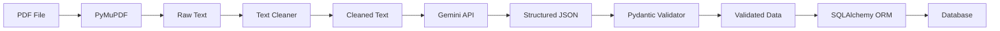

### Job Discovery Data Flow

```mermaid
graph LR
    A[Search Query] --> B[Search Engine]
    B --> C[Platform Connectors]
    C --> D[Selenium Scrapers]
    D --> E[Raw HTML]
    E --> F[BeautifulSoup Parser]
    F --> G[Job Data]
    G --> H[Deduplicator]
    H --> I[Unique Jobs]
    I --> J[Normalizer]
    J --> K[Normalized Jobs]
    K --> L[Database]
```

---

## 8. Deployment Architecture

### Production Deployment Diagram

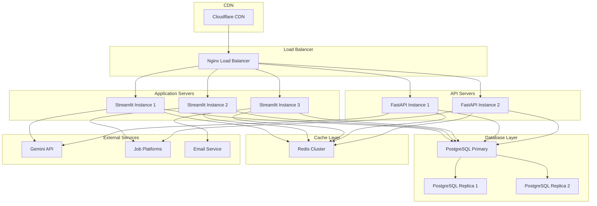

---

## 9. Security Architecture

### Authentication & Authorization Flow

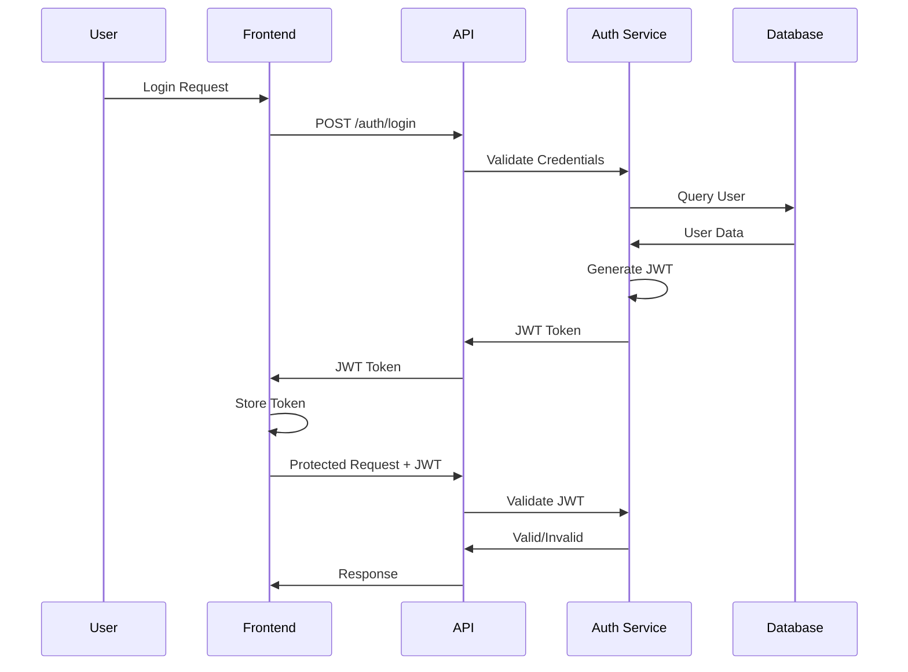

---

## 10. Microservices Architecture (Future)

### Planned Microservices Design

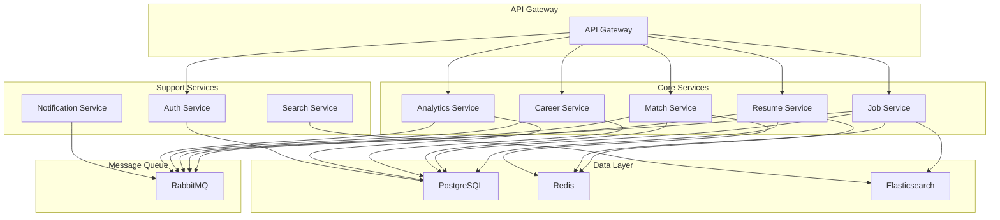

---

## Diagram Usage Guide

### How to View These Diagrams

1. **GitHub**: These diagrams render automatically in GitHub markdown
2. **VS Code**: Install Mermaid preview extension
3. **Online**: Use [Mermaid Live Editor](https://mermaid.live/)
4. **Documentation**: These are included in the architecture.md file

### Modifying Diagrams

1. Edit this file directly
2. Use Mermaid syntax
3. Test in Mermaid Live Editor
4. Commit changes to repository

### Adding New Diagrams

1. Follow the existing structure
2. Use appropriate diagram type (flowchart, sequence, erDiagram, etc.)
3. Add descriptive titles
4. Update this table of contents

---

## Diagram Standards

### Naming Conventions

- Use clear, descriptive names
- Follow camelCase for components
- Use PascalCase for classes/entities
- Use UPPER_CASE for constants

### Color Coding

- **Blue**: User/Client components
- **Green**: Service components
- **Orange**: Data components
- **Purple**: External services
- **Red**: Error/exception paths

### Complexity Guidelines

- Keep diagrams focused on single responsibility
- Avoid overcrowding with too many elements
- Use subgraphs for organization
- Provide clear labels and connections

---

**Last Updated**: June 20, 2026  
**Maintained By**: Jayesh  
**Version**: 1.0.0
